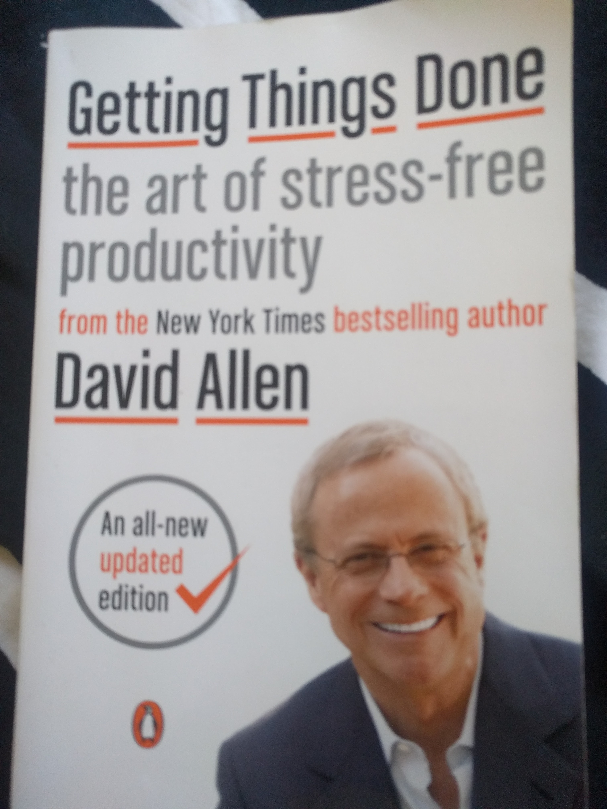
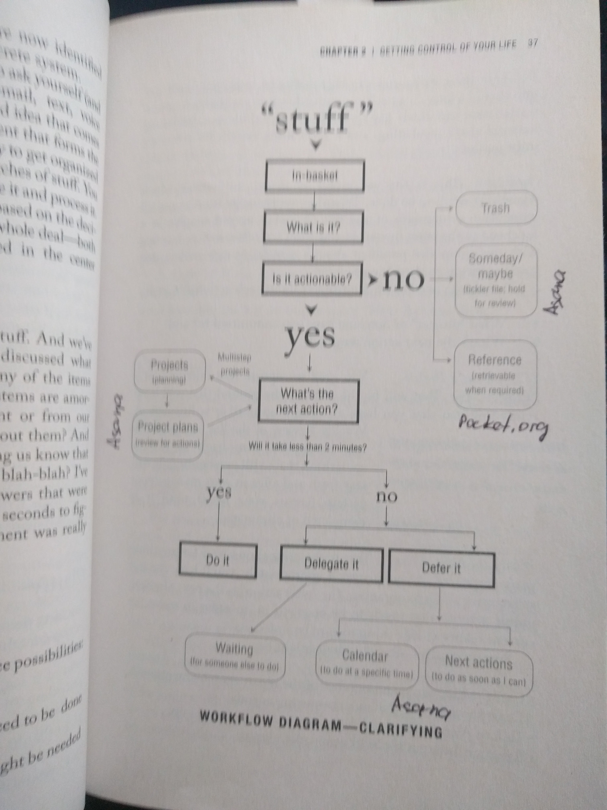

# GTD

`selfhelp` `book`

**Premises of our reality**

- our jobs and tasks keep changing
- nothing is really new in out hi-tech world expect for how frequently it is
- ability to generate power is proportional to ability to relax - mind like water (martial arts)
- mind should be empty to be open for everything
- Dealing effectively with internal commitments
    1. problem statement
    2. definition of done (what is the expected results from this project?)
    3. next action to move forward
- people think a lot, but most of the thinking is OF the problem, not ABOUT the problem
- most often, something is in your mind, because you want it to be different from what it is now (Zeigarnik effect, Willpower book: brain will keep reminding you about it all the time, until you do it, or “promise” it to do it later (schedule real action)).
    - you haven’t clarified the intended outcome
    - you haven’t decided the next action
    - you don’t have reminders about the outcome in the trusted system
- GTD requires 2 basic things:
    - defining what is “done”
    - defining what “doing” looks like
- it is a waste of time to think of things twice, so put thoughts in some trusted system (trying Asana now).

**Five steps of mastering workflow**

1. Capture
    - open loop - task from any input: your mind, email, relatives, etc.
    - every open loop should be in the input bucket of your trusted system (Asana) and out of your mind.
    - empty inputs regularly (e.g. every morning), see next step.
2. Clarify

1. Organize
    - Move tasks from input to projects
    - Set due dates for timed actions
    - Defer actions which can be deferred (‘Later’ and ‘Upcoming’ lists)
    - Delegate if it is possible and put on hold till it is done by someone
    - Do things which should be done today
2. Reflect
    - Do weekly reviews to CLEAN inputs, reorganize Projects.
3. Engage
    - do things based on criteria: context (e.g place you are now), time available, energy available, priority.
    - three types of work - predefined (from Upcoming bucket), immediate tasks that show up during the day, defining upcoming tasks.

**Five phases of project planning**

-    Horizontal focus - clearly defined projects/outcomes, and reminders placed in a trusted system. This chapter is about vertical focus - project planning.
- Natural planning model (how brain works):
    1. defining purpose and principles
    2. outcome visioning
    3. brainstorming
    4. organizing
    5. identifying next action
- same system cold be applied to any decision-planning process
- _Purpose_. During all project stages, don’t forget to ask yourself _WHY_ question. Because for us it is easy to create things, got caught up with them, letting connection with the real problem slip. Write down the answer to WHY question and review it regularly.
- _Principles_. Are critical for driving the project. It defines parameters and boundaries. Ask yourself:
    - I would give others totally free reign to do this as long as they…
    - What behavior might undermine what I am doing and how I prevent it?
- _Vision/outcome_. This is _WHAT_ question.
    - helps you to focus on the process (we notice only things which match our internal context and beliefs, so set this context up by visualizing it)
    - you won’t see how to do things until you see yourself doing it, so, visualize the outcome and the ways you achieve it.
- _Brainstorming_. 
    - Mind mapping techniques.
    - Brain won’t give you too many ideas if you won’t collect them in some trusted place (distributed cognition)
- _Organizing_.
    - Once you get all the ideas off your head and on paper in front of you, you’ll naturally notice relationships and structure.
    - Project planning.
- _Next actions_.
    - should also naturally fall off the organizing stage.
- So, the project planning guidelines:
    1. Why am I doing this?
    2. What principles should drive the project?
    3. What is detailed picture of desired outcome?
    4. Brainstorm ideas -> organize -> define next actions. 
