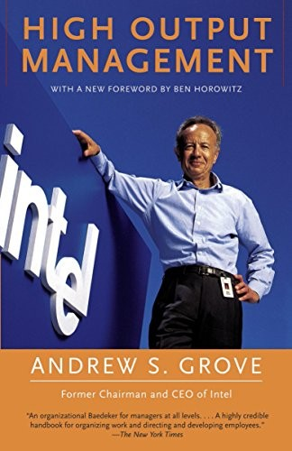

# High Output management

`management` `production` `product management` `project management` `book`



## 1.) The basics of production (delivering a breakfast)

Basic requirements of production - to build and deliver products in response to demands of the customer at

- a scheduled delivery time
- an acceptable quality level
- a lowest possible cost

Extreme 1 - infinite ready-to-deliver inventory. Delivery time is minimal, but it is costly.

Extreme 2 - endless production capacity. Every request will start new production workflow immediately, does not scale well.

Optimal solution approach:

- find the limiting step (in this case the step longest to prepare)
- it defines the total throughput time (which in the best case is equal to limiting step if other smaller steps are done in parallel, or served from the inventory)
- offset other steps to the completion of limiting step (do not pour coffee too early)

Production operations:

- process
- assembly
- test

Possible complication:

- resource limits (boiling the egg was the limiting step, but since the toaster is busy, there is waiting time for the toast, so total waiting + toast preparation time will now be a limiting step)
- what if it is time to boil egg, but you are still in the toaster queue?

How to deal with resource bottleneck:

- add capital equipment (add toasters) - 
- build continuous inventory (and throw away some toast) - waste)
- assign specified agents to each activity, single actor - no contention (single toaster operator), people overhead

Continuous operation (conveyor) - scales well at the expense of flexibility. The cost of failure is also high (one stage failing will cause the whole pipeline to fail). 

Ways to deal with failures:

- functional tests (periodic)
- in-process inspection. 
    - incoming inspection may encounter issues - you want to have inventory of raw materials to cover for problematic input, until it is fixed.

Added value.

Common characteristic of all production flows - the material becomes more valuable as it moves through. Hence the rule - try to detect the defect at the earliest stage possible.

## 2.) Managing the breakfast factory

Check indicators constantly:

- output forecast
- raw material inventory
- equipment
- manpower
- quality

Good indicators measure the output, not the activity. 

Use pairing indicators to measure both effect and counter-effect.

Black box analogy.

Every production process takes an input of raw material, labor and produces some output.

Linearity indicators, trend indicators, stagger chart.

### Controlling the future output

Industries that build to order. To increase time-to-market, build to forecast. Prepare inventory of products or ready parts to increase the speed of delivery of forecasted orders. Risk of unused inventory.

Ideal is to match the forecasted production with sales.

Inventory must be kept at the lowest-value stage possible.

## Assuring quality

More inspections. Incoming inspection, in-process inspection, final inspection.

To cover for incoming inspection failures, keep raw inventory.

Reduce the cost of in-process inspection and final inspection by sampling.

## Productivity

The productivity of any black box is the output divided by labor. 

One way to increase productivity is to do things faster. 

Another way is leverage (same labor achieve better output).

Types of leverage:

- work simplification (remove steps)
- automation

## 3.) Managerial leverage

Managerial output = The output of his organization + the output of organizations under his influence. In other way, the output of the whole team.

Among competing activities choose the one with the greater leverage.

Types of activities:

- information gathering
- decision making (if you are "know how" manager)
- nudging

Tip: the activity of writing a report is more important than reading it. If you trust the person, report is secondary (but important for that person)

### Increasing the leverage

1. higher leverage 

- when many people are affected by one manager. 
- when little manager's work increases the employee's output for many days
- when a large group's work depends on your unique information

Negative leverage:

- not having a clear goal for the meeting
- meddling

Delegation as leverage works if:

- common information base
- common set of ideas and problem solving notions
- monitoring instead of meddling

1. increase managerial activity rate 

- identify the limiting step
- batch similar steps
- meetings forecasting
- saying no to meetings beyond capacity

1. switch to activities with greater leverage

## 4.) Meetings - the medium of managerial work

### Process oriented meetings

One-on-ones

At least 1 hour, subordinate to prepare agenda. Subordinate to share report, latest developments, issues. Supervisor is to ask questions to dig down to the bottom of issues.

How to do? Start from project status, indicators, etc., the most important are the ones that signal trouble. Then cover latest developments, problems, potential problems that subordinate sees.

Better if both take notes.

```
As a side note, taking notes helps digesting the info and prevents the mind from drifting.
```

Exchange notes in the end.

Leverage of one-on-ones: by spending 1.5h you will enhance the subordinate quality of work for the next 2 weeks (80h), and you will be aware of what he is doing.

Staff meetings

Opportunity for interaction among peers.  Supervisor is facilitator (inactive), subordinates must be active. Supervisor observes, helps to make decisions, times discussions.

Operation reviews

Comes in a way of presentations across departments (knowledge sharing).

```
Discuss slide at least 4 minutes
```

Supervisor is to encourage participation from other managers.

### Mission oriented meeting

Here the "chairman" is the most important.

What is the goal of the meeting? What is the result expected (decision made)? Could the meeting be avoided?

- be in time
- send agenda in advance and follow it

## 5.) Decisions

Ideal model:

- free discussion (everyone speaks, regarding of rank)
- clear decision (do not obscure matters to avoid the argument)
- full support (those who disagree, have to commit too)

Decisions must be reached out at the lowest competent level - people doing the actual work must know how and why it was made.

Do not push to make decision too early in discussion, and do not make it too late either. If discussion is stuck, decision is to be made by person with authority.

Questions to settle in advance:

- what decision needs to be made?
- when does it have to be made?
- who will decide?
- who needs to be consulted prior to making decision?
- who will ratify or veto the decision?
- who will need to be informed of the decision?

## 6.) Planning: Today's actions for tomorrow's output

Step 1. Establish projected need or demand from the environment. Environment consists of

- customers (who are they and what is their expectation of your performance)
- vendors (what is their performance and is it satisfactory)
- competitors (evaluate yourself against them)

Now I am doing things that satisfy customers' _current_ demand. What is their demands of me in a year from now? What is the _difference_? What actions need to be taken now to satisfy this demand in a year (to close the _difference_ gap)? 

Do not plan practical steps!

Step 2. Establish present status.

What am I producing right now? 

What are the projects that will be completed within a year? What is their output?

Step 3. Identify steps to close the difference gap.

Changes in old tasks, or new tasks. 

Can I close the gap? If no, can I narrow the gap?

What effect will my actions have on narrowing the gap, and when?

Answers to these questions will set the strategy.

The output of planning is the set of tasks to be implemented today to solve or avoid tomorrow's problem.

Management by objectives (OKRs)

1. where do i want to go? (objective)
2. how will I pace myself to get there? (milestones, key results)

MBO complements long-term plans with short-term iterations. Feedback on achieving milestones must be quick.

Many objectives are bad - learn to say no.

System must be set up in a way: Manager's objectives, if achieved, will achieve his supervisor's objectives too.

## 7.) Going national

How to organize units across organization, when the global expansion happens.

Two extremes:

- mission-oriented form (executive office -> regional offices -> individual units responsible for everything - finance, production, administration, etc) - distributed business units, each responsible for its supplies, finance, etc.
- functional form (executive office -> functional offices (merchandising, finance, HR, etc.) - centralized, business units provide labour, while finance, supplies, etc., come from the central office.
- hybrid - most real-life companies

## 8.) Hybrid organizations 

Central part of hybrid organization: reconciliation between centralization (allows to utilize economies of scale better) and decentralization (allows local manager to respond to local conditions faster).

Hence, some groups are functional, and some component business groups are local.  Functional groups could be viewed as internal subcontractors.

Examples of obvious functional units are Sales, Administration, Manufacturing, etc.

## 9.) Dual reporting

With hybrid approach, some decisions will have functional supervisor in the headquarters, and another local supervisor (head of the mission oriented business unit). Each project consists of decisions of both types. Who is in charge?

Why can't local manager be in charge? The story given on how a sales person progresses career to sales manager, then to regional sales manager, to general manager of the business division. His background is still sales, but he has other regional managers reporting to him, e.g. engineering managers, who have much more experience in their field. So, the person with sales background can't supervise engineering managers. What if they all report to senior engineering manager (functional form)? Now the problem is the coordination with other units, like marketing, sales, etc. One centralized senior manager will slow everything down.

So we go back to our sales person who rose to division manager. He is responsible for coordinating decision making inside the business unit. But he needs someone with technical expertise to supervise engineering managers. Does it have to be a single person? No. 

Suggested approach is that such role could be handled by the _peer group_ of engineering managers from different business units. Each person in the group reports to his own division manager, but they together form the technical supervision body, to whom they all report. It means decisions are taken as a group, and people comply with group decisions (corporate culture is necessary for this to work).

Should the peer group be chaired by the general functional manager? It depends.

When implemented, it will appear that one person will appear in two org charts (two planes)

## 10.) Modes of control

- free-market forces 
    - actions are taken as if by economic agents, no need to manage
- contractual obligations
    - set the rules, monitor adherence, improve performance
- cultural values 
    - nurture common set of values that promotes trust

How to chose? Based on 2 factors: person's motivation; complexity, uncertainty, ambiguity (CUA).

Low self-interest & low CUA - contractual obligations (pay money for people to do their job)

High self-interest & low CUA - free-market forces

Low self-interest & high CUA - cultural values

High self-interest & high CUA - nothing works!

## 11.) The sports analogy

How to elicit the peak performance from employees? (this will increase the managerial output, as defined above)

Two ways to improve employee's output:

- training 
- motivation

Motivation comes from within, so manager has to create right conditions for it.

Maslow's pyramid of motivation (tied to needs).

- physiological
- safety/security
- social/affiliation
- esteem/recognition
- self-actualization

Only the last one provides infinite motivation, others stops motivating once achieved.

Inner forces to drive self-actualization:

- competence (endless mastery of task - violinist)
- achievement (obsession with achieving the goal)

Both forces are spontaneous. The task of the manager is to create environment for them to appear:

- Managing By Objectives
- goals focused on output, not activity
- task-relevant feedback (money only motivates on first two levels; later it becomes the measure of achievement)
- only if performance indicators are aligned with business KPIs, those become relevant
- fear of failure could be a positive or negative motivation (watch where you are conservative, this may be caused by fear)
- a sense of competition may help at work

## 12.) Task-relevant maturity

Management style depends on how employee is fit for the task (not his overall experience, as the task may be new for him) - TRM.

low TRM - structured, task-oriented management style (what, when, how)

medium TRM - individual-oriented, two-way communication; mutual reasoning

high TRM  - establish objective and monitoring

Beware of logical biases, it is easy to downgrade employee to the low (defining medium is hard, we tend to choose either of the sides easier).

Management style depends on situation. In emergency, it could be better to retract to structured style, even with experienced people.

## 13.) Performance appraisal

Performance review is the most important type of task-relevant feedback. The purpose is to improve employee's performance.

How to assess performance?

- assess both output (of employee, or whole division for the manager) and internal measures (inside of black box)
- the performance rating of a manager can't be higher than the one of his organization (avoid "potential" trap)
- keep in mind that some activities may not be reflected in the output (delayed effect)

How to deliver?

- preparation:
    - collect feedback (peers, supervisors, clients, documents)
    - write down positives and negatives as bullet points
    - group together (often they are connected) to form messages
- leave only several key messages
- delivering negative feedback
    - remember stages of problem solving: ignore, deny, blame others, assume responsibility, find solution.
    - your goal is to make employee assume responsibility, and you will find solution later
    - he can assume responsibility even if he disagrees (commitment)
    - reviewing superior employees should not focus, find ways to improve even further
    - ask for self-review from employee first  and compare with yours
    - deliver paper copy before the meeting with employee, so he has time to digest

## 14.) Interviewing  and convincing people to stay

Very detailed examples of actions are given, which I'm going to skip

## 15.) Compensation as task-relevant feedback

Two promotion systems:

- experience based
- merit based

in the merit based system, consider Peter Principle: is someone is good at his job, he is promoted; he keeps getting promoted until he reaches his level of incompetence and stays there.

## 16.) Why training is the Boss's job

Advice on how to prepare the training. It is hard, in short. But worth it.

---

Lessons learned:

- define your output (for project manager, the product  itself is output; for product manager, the output is customer satisfaction, etc., for senior manager, the output is profits).
- think of every product as production pipeline, there is always compromise between equipment capacity, manpower and inventory.
- find the limiting step - build workflow around it. Iterate, limiting step will change.
- detect anomalies as early as possible
