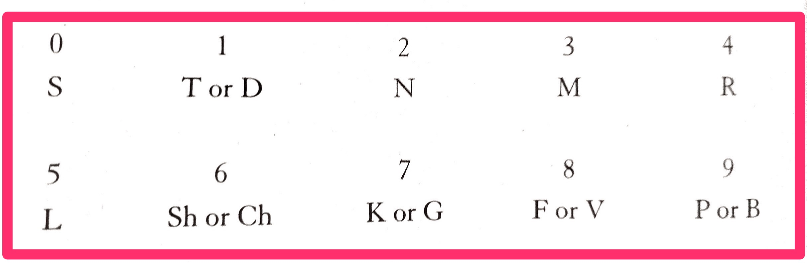

# Moonwalking with Einstein

1. Anyone can memorize structured information (lists, sequential) with special techniques.
2. Luria A.R. "The mind of mnemonist". Describes one real phenomenon, who could memorize huge lists (words, numbers), and the memory lasted forever. In his mind everything was an image, even with smell. And it turns out our mind is much better used to memorizing images (evolution). 
3. Memory of normal human is divided to short working memory and permanent memory. Working memory is small, easy to overload, new data will. Putting data into permanent memory require some effort.
4. Memory has complex structure - it is not linear, it is a net. Even if the fact itself is forgotten, there is some link from other memories which may help to recall it.
5. Memories gradually decay with time (proven research)
6. Latest trend - externalization of the memory (books, computer), which makes human memory not so important, so it degrades.
7. Memory palace - techniques based on the idea of placing items in very well known location (home, work). Each object is an image. Everything should be mapped to image. Images are constant and memorized by rote memorization.
8. Table for memorizing long number sequences. Divide it in parts of 3-4, map to letters, get abbreviations like MSh, NLP, ShL, substitute it with images of MeSh, Neuro-linguistic programming, Shell. Store in memory palace.

1. Ok plateau. Happens in every field.
