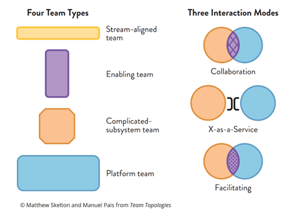

# Team Topologies

`management` `product management` `project management` `book`

# 

# Part 1. Teams as the means of Delivery

### 1.) Problem with Org Charts

Hierarchical Org charts might be effective in case of emergency (army), project where strict rules and strong control are required (legal). In environments with uncertainty (Lean, Agile), such structures could impede the progress.

- OC is rigid communication structure, treating people like architecture, not adaptable
- Matrix structure - employees report to business and functional managers (popular since 90s)
- Systems thinking - think beyond department boundaries
- Information flow:
    - formal structure (org chart)
    - informal structure (influence)
    - value creation structure (inter person and inter team communication)
- Team topologies should evolve with the stages of company growth and stages of each project (discovery, CRs, maintenance)
- Acknowledge the Team is important element of software delivery
- Conway's Law: Organizations will produce systems that are copies of communication structures
- Acknowledge the Team has limited cognitive capacity
- Maintenance of existing projects takes cognitive capacity away from new projects

### 

### 2.) Conway's law

- "if architecture of a system and architecture of org are at odds, the architecture of org wins". Certain architectures can not be discovered, as  relevant communication paths do not exist.
- inverse Conway maneuver: orgs should evolve their team and org structure to achieve the desired architecture. The goal of architecture is to provide the ability of teams to get whole work done (including all stages from design to deployment) without requiring high bandwidth communication between teams. So the architecture must be decided **before** we form teams. ("Team assignments are the first draft of Architecture").
    - follow DDD
    - low coupling between teams, high cohesion inside teams
    - clear version compatibility, clear cross-team testing
- minimize communication between teams (number of communication paths). If teams are communicating, but should not, something is wrong.
- communication patterns are different for various stage of the project. During research, communication is important, but when product reached execution stage, communication is unnecessary overhead.
- Naive reverse Conway's maneuver implementations:
    - tool choices drive communication paths (reduce communication paths with tools where they aren't necessary. E.g.: use Jira to assign tickets from outside the team, use Slack to communicate inside the team)
    - many different component teams (prefer stream-aligned teams to complicated subsystem teams)

### 

### 3.) Team first thinking

- Small sized long lived teams (2 pizza)
- Dunbar number, 5-9 is best team size, team of teams - tribe (15), department (50-150)
- lessons from "Mythical Man month" - adding more people may slow down, especially during onboarding
- team evolution stages: forming, storming, norming, performing
- team first mindset inside and outside
- measure cognitive load and limit it for the team, limit the number of domains per team (several simple domains is ok, several complex is not; more than one team per domain is never ok)
- define Team APIs to interact between teams: runtime endpoints, code, documentation, UX
- explicitly design physical and virtual environments to help interaction

# Part 2. Team Topologies that work for Flow

### 4.) Static Team Topologies

Anti-patterns:

- ad hoc team design (e.g.: split the team just because it has grown too large)
- shuffling team members
- separate DevOps team (bottleneck!)

Key takeaways:

- design for flow (team structures will change) 
- cross functional teams with no handovers
- rapid feedback

Good team requirements:

- maturity to see the changes needed in advance
- non-blocking dependencies on other teams
    - platform team provides capabilities to launch (even in the cloud), handles concerns like security, etc.
- Detect and track team interdependencies!
- Evolve teams in steps

### 5.) Fundamental Team Topologies 

There is no Ops or Support team!

**Stream-Aligned Teams (SAT)**

Team is aligned to a single _stream of work�_� (product, service, feature set, user story). Team is empowered to build and deliver independently and without handovers to perform parts of work.

- The main team type, other teams aim to reduce the burden of these teams
- most teams in the org are SAT
- Streams is something that funds the SAT long-term, it is a part of larger portfolio of work (specific customer, business area, geography, etc.)

Responsibilities of SAT (some are handled with other teams' support):

- security
- commercial viability analysis
- design and architecture
- dev and coding
- infra and operability
- metrics and monitoring
- product management and ownership
- testing and QA
- UX

Outcomes:

- steady flow of feature delivery
- quick correction based on feedback
- experimentation
- no hand-offs
- stream of changes produced is measurable
- team has time to address code quality and tech debt concerns
- gets help from supporting teams

**Enabling Team (ET)**

Unlike SAT, they have bandwidth to research, anticipate change, etc. Allows SAT to acquire some capabilities faster.

They need to solve problems for SAT, share knowledge and allow them to work autonomously after that.

The work of ET maps to any of the Outcomes of SAT.

Outcomes:

- proactively seek to understand the needs of SATs, establish regular checkpoints and agree when more collaboration is needed.
- keep abreast of new tooling, approaches and practices
- anticipates the needs of SAT
- promotes learning across SATs

**Complicated-Subsystem Teams**

Builds a system that requires specialized knowledge and provides simple API to other teams.

- reduces the cognitive load of SAT

The team is identified by complexity of service (not by opportunity to reuse)

Outcomes:

- tight collaboration with SAT during early stages; focus on the API later
- work is prioritized according to SAT needs

**Platform Team (PT)**

The purpose is to help SAT deliver with substantial autonomy.

Platform (not a new term) reflects that it is developed as reliable service to be consumed inside the org or outside.

- common platforms abstract away cross cutting concerns (network, infrastructure, etc.)

Outcomes:

- collaboration with SAT to understand their needs
- fast prototyping to understand what works for SAT and what does not
- lead by example and promote adoption

The platform build process may be decomposed into streams handled by all other teams (including PT for a smaller part)

Guidelines:

- avoid silos (QA team, Architecture team, DevOps team, etc.), prefer cross-functional teams
- avoid Platforms growing too big, reduce complexity, best platforms strive for low user cognitive load (UX, DevEx)
- build platforms on platforms
- manage platform as a product or service (treat internal teams as external clients)

Team evolution advice:

- mostly stream-aligned teams
- infrastructure teams to platform teams
- component teams to PT, ET, CST
- tooling teams to ET or part of PT
- no dedicated support team, it becomes a part of many SAT
- architecture team as a part of ET
- combine teams of all types in a loosely coupled modules

### 6.) Team first boundaries

- Monolith to loosely coupled services 

Types of monoliths:

    - app
    - shared db
    - shared CI
    - shared releases
    - model (single view of the world)
    - thinking (standardization)
    - workplace (open space office)
- "Fracture planes" - how to split
    - DDD bounded contexts
    - regulatory compliance
    - change cadence
    - team location
    - risk
    - performance isolation
    - technology
    - user personas

Choose boundaries to match cognitive load.

# Part 3. Evolving team interactions for innovation and rapid delivery

### 7.) Team interaction modes

Research: intermittent (not constant!) collaboration gives best results.

**Collaboration**

- exploration of new technologies or techniques, rapid discovery 
- one teams' skill set is not enough
- two teams working closely for a limited time - no hand-offs
- teams are blurring; shared responsibility, more cognitive load
- _high interaction and mutual respect_

**X-as-a-Service**

- clear responsibility, one team uses the component that is well defined and just works (service boundary is well chosen and well implemented)
- reduced detail, no cognitive overload
- slower innovation, API could reduce flow
- _emphasize the user experience_

**Facilitating**

- sense and reduce gaps
- one team coaches the other until the capability is developed
- experienced team (coaches) is busy but not working on projects
- interaction might be strange (need time to learn to work together)
- _help and be helped_

Tips:

- use team topologies and interactions with conjunction to reverse Conway maneuver
- discover APIs between teams 
- use collaboration mode to discover x-as-a-service interactions
- use awkwardness in team interactions to sense misplaced boundaries or wrong collaboration modes

### 8.) Evolve team structures with organizational sensing

1. systems thinking
2. feedback loops
3. culture of continuous learning

_Summary:_

How to get started:

- Start with the Team
    - how can the team be more efficient
    - how to reduce cognitive load
    - how to build focus on user needs
- Identify streams of change
    - what are the sources of Team's work?
- Identify Thinnest Viable Platform
    - how the platform will make life easier for SAT
- Identify capability gaps in mentoring, coaching, service management, documentation
- Share and practice new interaction modes and explain principles 
