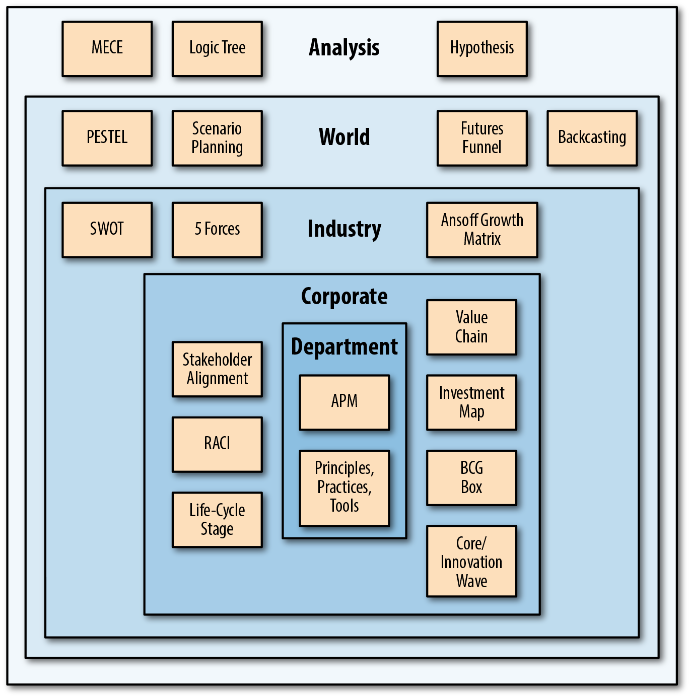

# Technology strategy patterns

`architecture` `book`

Architect's work - a set of tech and strategic models that create a context for position (capability), velocity and potential to harmonize strategic business and technology goals.

- contain entropy
- specify non-functional requirements (architecture characteristics)
- determine trade-offs

Strategist's work - determining the best balance between a set of goals, the method used to achieve them, and the resources available as means.

- identify business development opportunities
- propose mergers and acquisitions
- build strategic internal capabilities (follow growing trends, AI, etc)
- perform research based on data and recommend long-term direction

        Strategy

      /                  \

Culture  --  Execution

# Creational patterns

## Analysis

It is about making choices from competing viable alternatives.

Opportunity cost - a gain from choosing an option compared to potential gain from option not chosen.

- survey landscape across industry, organization, customers, employees, etc.
- examine tech trends
- decide what to do and what not to do
- how to allocate resources

### MECE

Mutually Exclusive Collectively Exhaustive - lists. Properly conceived list makes it clear:

- who target audience is
- why they care

Information in the list must help them make decision (by providing new knowledge). Lists are not to explain - but  to direct the course of action.

### Logic Tree

Diagnostic LT - to determine the problem.

Ask Why something happened.

Solution LT - to determine the solution.

Suggests How to proceed.

Always create both. 

- Start from Diagnostic,  Use five Whys technique, or Fishbone diagram
- it gives you the root problems. 
- for each root problem,  define  what the solution could be (the ideal state where root problem no longer exists)
- proceed from solution regressing towards the root problem, in the linear series of steps.

TBC