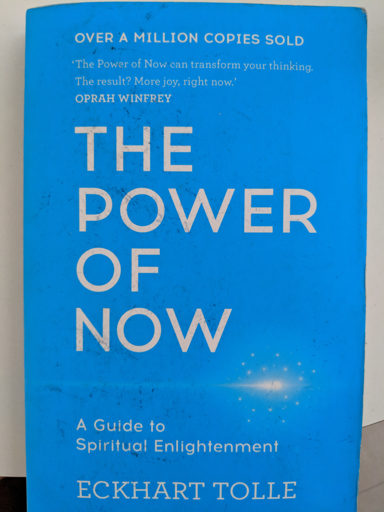

# The Power of Now

**You are not your mind**

    

Buddha’s simple definition of _enlightenment_  - end of suffering. It only tells you what E is not: no suffering. There is no answer to what is there when there is no suffering, so you’ll have to find it yourself. He uses negative definition so that mind can not make it into something to believe in. Belief may be comforting, but only through your own experience it becomes liberating.

E. is not an accomplishment - it is oneness with Being. Word Being is used, as it is broader concept than God. It is not reducing infinite to a single image.

Our mind is a tool, which we are supposed to use only when we need so. But it is almost always on, always thinking, so we associate ourselves with what we think.

First thing to do - is try to step outside and watch your thinking, without judging, just observing how different thoughts and emotions arise. This is called Presence. Being aware of your thoughts as a voice inside - comes from beyond the mind. You realize that there is a mind producing some thought, and here _I am_, just watching it.

Instead of “watching the thinker”, you may create a gap in the thinking process, by concentrating on something that is here and now, like your breath. In this state you are alert, but not thinking. This is the essence of meditation. It requires practice, mind will eventually wander, but once you notice it - gently bring it to the point of focus, to the Now. It is normal. It is the process of training of your consciousness.

Emotions arise as reflections of your mind in the body, so the same idea of watching applies to them too. If your mind disagrees with emotion - you should trust emotions rather then doubting mind. In the end, you will allow emotion to be without being controlled by it. Be no longer an emotion, be the watcher.

Emotions and thinking often create a vicious circle, feeding each other. The more you think about emotion and its cause - the worse your body response is - emotion is growing.

Don’t try to solve emotional problems with thinking mind - it is the reason emotion arises in the first place.

Love, joy come from within. Pleasure is derived from outside. And always contains negative as its opposite. Don’t call a crush for someone Love. Such affection becomes negative emotion when there are any problems in relationships.

**Consciousness: the way out of pain**

The pain is the act of non-acceptance.

Anticipation of the pain causes fears of different nature - fear of loss, failure; anxiety.  But ultimately all fears are derived form ego’s fear of annihilation. Whenever ego feels threatened - it generates emotion as a body reaction. This emotion is fear of death of your mind-identified self. It affects every aspect of life. For example, the desire to always be right in the argument, making other person wrong - is defending the mental position with which you are identified - is caused by ego’s fear of death. Being wrong means to die for the ego-driven mind.

Once you are disidentified from your mind, many ego related problems cease to matter. Like “ego” questions of right and wrong, causing fear of failure, or anxiety when someone has different point of view.

First _accept_ what is, then _act_ according to it. Not against the circumstances, but with them.

Observe “pain-body” - your fears, anxiety. Don’t analyze, just watch.

Ask yourself _what are you defending_?  - watch for any kind of defensiveness within yourself. This is Ego trying to preserve some illusory identity. When you start asking yourself that - you will find a way out of ego and mind identification -> out of pain.

Ego is searching for wholeness by craving for something - interesting idea to observe in yourself.

**Moving deeply into the Now**

Zen: “What at this moment, is lacking?” - deep question which has no answer at the level of mind.

Goals.

Future is usually imagined as better or worse than present. If it is better - it gives you pleasurable anticipation, if it is worse - anxiety. Both are illusory.

When you set yourself a goal and seek happiness or fulfillment in it - Now is no longer honored. That is the main flaw in collective manifestations like religion, communism, etc. Which promise you better future.

So set yourself goals, but do not hope. Just do whatever needs to be done, enjoy the process.

Is fulfillment always around the corner or confined of short-lived pleasures, like food, sex, etc.?

Are you always focusing on becoming, achieving, or chasing some new pleasure?

Are you waiting for someone to give meaning to your life? Child?

It does not matter what you are doing, what matters is How. If you doesn’t find joy in it - don’t change activity, try to change the approach. Pay more attention to the doing, not result. Be present. Do with ease, not against your will.

**Mind strategies for avoiding the Now**

Psychological time. When you need past for your identity and future for your fulfillment. In both you are not present. But knowing that you are not present is a great success already. A first step.

The best indicator of your level of consciousness is how you deal with life’s challenges when they come. Not your ability to sit and meditate for hours.

Mind resistance will manifest itself int the form of judgement, discontent and mental projection away from the Now. On the emotional level - it is unease, tension, boredom or nervousness. These all are aspects of mind in habitual resistance mode.

Make it a habit to monitor your mental-emotional state by asking “Am I at ease at  this moment?” If you are not, your mind is resisting. You have three options here: remove yourself from the situation, change it or accept it fully. Accepting (surrender) is discussed in further chapter. If you have to do something - do it Now, immediately, or accept and enjoy your not doing immediately. It is fine to be lazy sometimes. Observe the mind telling you that you are wasting your time, and should be working instead. 

Die to past every moment. You don’t need it.

Have goals for future, but do not allow them to define who you are.

**The state of presence**

Experiment: close your eyes and try to catch your very next thought which comes to mind. It takes time for the first thought to come, since you are very alert - Present. Mind is not wandering. Until first though came in, then they all flow as usual. 

You need some hook to stop mind from wandering and be present like watching your breath, or listening to the silence. There is always silence between sounds around you.

**The inner body**

Two extremes - associating yourself with your body, and complete denial of the body. First means not being present, but second means denial of Being as well, because only through your body you will connect with Being. So love your body and take care of it. In case it means denial of religious concepts of fasting and asceticism.

Make a habit to connect with your inner body, especially in front of some challenge. Seek for energy inside to accept whatever the situation is, then act accordingly.

Forgiveness. Many emotions are fed by blame, self-pity, grievance. Which are all forms of non forgiveness of yourself, someone, circumstances. The mind cannot forgive, only You can.

**Portals into the Unmanifested**

(not ready for this now)

**Enlightened relationships**

Searching for happiness means searching for salvation from a state of unsatisfactoriness and insufficiency. As every projection to the future it is a false goal. 

You find God the moment you realize that you don’t need to find God.

“Love” relationships, can turn into hate relationships. Because you need someone to make you feel better, you are emotionally dependent, you are not present. It is part of Ego’s search for wholeness.

The main point of this chapter is that if you are on the same page as a couple, it is easier to discuss your emotions, it is easier to point your partner to idea that he/she is not present. Work together to be more conscious. Requires trust and honesty about everything, even about negative emotion you feel about him or her.

**Beyond happiness and unhappiness, there is peace**

Happiness depends on conditions being perceived as positive, inner peace does not.

Things are not good or bad, things are as they are. They are good-bad, love-hate, like-dislike only from position of the mind.

There are natural cycles in life, which include successes and failures, but all thiese forms are impermanent, every failure could be turned into success, as it asks you for some change.

Association with success breaks natural cycles.
