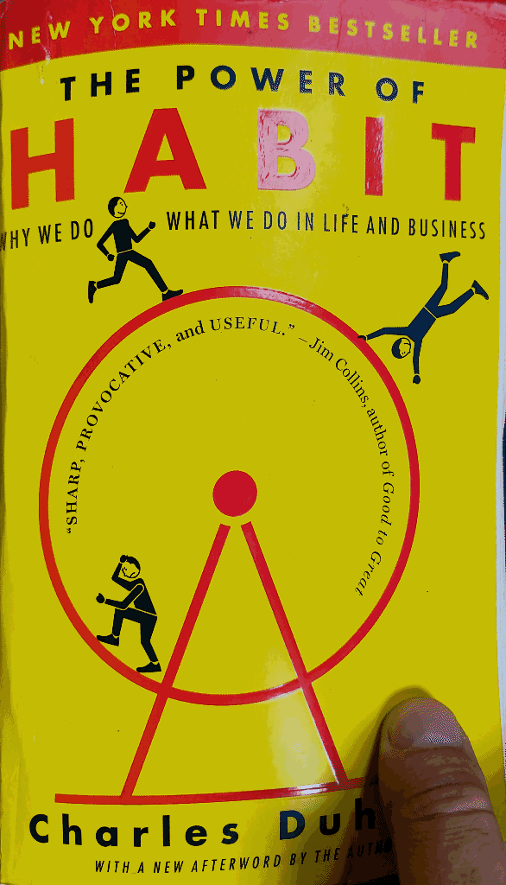
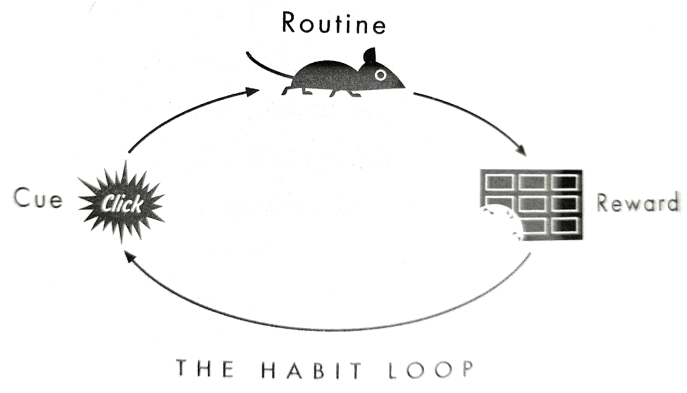

# The power of habit

1. Habits of individuals

Habits involve basal ganglia - a part of the brain which operates without long-term memory (optimization).

Craving is anticipation of reward in already formed habit loop. Create a reward which works without you thinking about it - craving forms - and you create a habit (marketing, e.g. craving for tooth tinkling after brushing).

Golden rule of habit change: leave cue and reward, change routine. 

In extreme situations habits don't work.

It is better to rely on group while changing habits.

Belief is essential for changing a habit (e.g. Alcoholics Anonymous).

2. Habits of successful organizations.

Keystone habit - allows you to progress by doing "small wins". Might not be related to the final goal, but makes it easier to achieve (less Willpower required). E.g. Alcoa - focus on workers safety lead to better production index. 

Keystone habits are hard to identify.

Having predefined routine (trained before) is much less will power depleting. Will power becomes a habit if you follow such routine when inflection point arrives.

Doing something for personal reasons is much easier then following orders. So, giving employees a sense if agency will pay off.

Big companies make choices based on operational habits created by masses. Such routines allow for truces between competing departments to get things done.

Sometimes later routines fail, and it is always bad. But crisis is a best opportunity to make change. In fact they are so valuable, that wise leader prolongs the sense of emergency on purpose. It is the only way in companies with bad habits to make positive changes. E.g. London metro - only after a big crisis they introduced the keystone habit on safety.

People are most likely to change their buying habits while going through big changes in their lives, unconsciously. The biggest thing is having a baby.

The key to creating a habit is to make routine look familiar. Or surround it with familiar things. E.g. songs on the radio - sandwich.

3. Habits of societies.

First key for social habits to emerge - multiple strong ties with the community.

Second key - peer pressure (weak ties). They might be more important in ones life as they access to circles the person doesn't belong. It is not likely that you give up something if you made a commitment in a community with weak ties. 

Habits spread when there are followers, provided by weak ties. That's how they scale.

The third key - idea should be self driving (keystone habit).

Guide to using this ideas (to get rid of bad habits):

1) Identify the routine.

    The most obvious - that what you want to change.

2) Experiment with rewards:

    We often are not aware of cravings that drive our behavior, so we can not be sure what is exactly the reward we are achieving with the bad habit.

- So, try to change your usual routine with alternatives (go for a walk instead of drinking coffee, or drink tea, or eat apple)
- After that jot down three first things that come to mind after completing this (changed) routine.
- Set alarm (wait) for 15 minutes.
- Ask yourself if you still feel the urge for initial routine.
- If not - you found the reward your body is actually craving for. Otherwise continue experiments.

3) Isolate the cue.

    Almost all habitual cues fit into categories:

- Location
- Time
- Emotional state
- Other people
- Immediately preceding action

So, at the moment the urge hits, write down answers to:

- where are you?
- what time is it?
- what’s your emotional state?
- who else is around?
- what action preceded the urge?

4) Have a plan.

    Once the whole habit loop is identified, you can predict the cue, and deliberately go for new routine, to prevent craving for older one.
