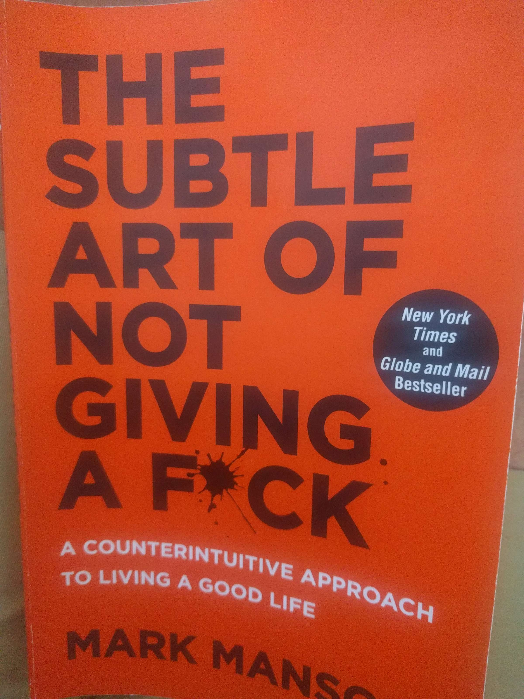

# The subtle art of not giving a fuck

`selfhelp` `philosophy` `psychology` `book`

Chapter 1. Don't try.

    1. Don't try (Bukowski story) -accept what you are with all the shotcomings.

    2. All the positive and self-help stuff we hear all the time - is fixating on our LACK. You perceive your shotcomings to already be, and start from there.

    3. Dreaming about smth all the time - reinforcing reality that you are not that. 

    4. All that - giving to many fucks - not good for mental health.

    5. Feedback loop from hell - "you start being anxious about smth, but then you are anxious about being anxious".

    6. The desire for more positive experience is itself a negative experience. And acceptance of negative experience is positive experience.

    7. Not giving fuck doesn't mean to be indifferent. It means being comfortable with being different.

    8. You can and should choose what to give fuck about. Not giving a fuck about anything is against our nature btw. You always choose what to give f* about, realizing it or not.

    9. Adversity do not deserve to give f* about. There are much more important things.

Chapter 2. Happiness is a problem 

    1. Buddha story. H is not a solvable equation.

    2. Dissatisfaction and unease are inherent parts of human nature. And they are necessary to create H.

    3. Suffering is biological means to inspire the change. Negative emotions - call to action.

    4. H. comes from solving problems, not from not having them. 

    5. Find problem u enjoy having and solving.

1. Obsession and over investment in emotions fails us for simple reason that emotions never last -> “hedonic treadmill”, working hard to change things but never feel different. 
2. Choose your struggle - the joy is the climb itself!

Chapter 3. You are not special.

1. Failed researches of 1960s showed that people who thought highly about themselves actually perform better. But to feel good about yourself you need to have a good reason. This is something that was missed.
2. Feeling good about yourself should NOT be the measure of self-esteem. It is more important what people feel about negative aspects of themselves. 
3. Mass media driven exceptionalism. Peeps feel they need to be more extreme (better?) to get noticed or matter.
4. Understanding that you are not great now (mediocre) is the first step towards becoming great - u will start thinking how to achieve that.

Chapter 4. The value of suffering.

- Layers of "self-awareness onion":
    - Understanding one's emotions.
    - Ability to ask why we feel them.
    - Why do I consider this to be success or failure?
- Our values determine the nature of our problems, and our problems determine the quality of our lives.
- What is true about the situation is not that important as how you choose to measure it.
- Shitty values:
    - Pleasure. Most superficial form of life satisfaction. Easy to obtain, easy to lose.
    - Material success. If you make enough money for your needs, extra buck doesn't change a lot - research.
    - Always being right. You decline yourself of learning.
    - Stay positive. Negative emotions are natural, learn to deal with them in acceptable way.
- Freud: "One day, in retrospect, the years of struggle will strike you as the most beautiful"
- "Self-improvement" is about prioritizing your values, choose better things to give a fuck about.

Chapter 5. We are always choosing.

- We are responsible for every shit happening in our life. Even if we are not to blame.
- Reassessing your values, you will be uncertain and feel resistance. And it is normal.

Chapter 6. We are wrong about everything.

- There is no absolute truth. Growth is iterative process of going from wrong to something less wrong.
- Certainty is the enemy of growth.
- Don't trust your conception of positive/negative experience. All that we know for certain is what hurts in the moment and what doesn't.
- Fake memory, 1980s.
- "Trust yourself" and all this crap are misleading. You should better question yourself when you sure that you are right. (AR: don't question afterwards though, whatever is done, is right).
- "The more something threatens your identity, the more u will avoid it."
- Questioning yourself:
    - What if I am wrong?
    - What would it mean if i were wrong?
    - Would being wrong create a better or worse problem?

Chapter 7. Failure is the way forward.

- Avoiding failure is something we only learn when grow up. We instinctively avoid failure and stick only to what is placed in front of us.
- Shitty values (car and house), once achieved, leave nothing left for you - midlife crisis?
- It is growth that generates happiness, not a list of arbitrary achievements. 
- It is only through pain we are willing to question why our values fail us. Chasing after highs (positive thinking) to cover up the pain, you'll never generate motivation to actually change. So don't act to reduce pain, act despite it.
- Do something..  action isn't just the effect of motivation, it is the cause of it.

Chapter 8. The importance of saying no.

- Absolute freedom, by itself means nothing.
- The way to achieve meaning and importance is through rejection of alternatives, narrowing freedom -> commitment.
- To value X you must reject non-X.
- Relationship. Victim and saver. Being responsible for your own shit. Saying no to partner asking to solve her problems.
- Paradox of choice -more options, more doubt that we've chosen the right. True freedom is in commitment and digging deeper into it.

Chapter 9. ... And then you die

- Ernest Becker "Denial of death"
- "Death terror" - a deep existential anxiety that underlies everything we do. We are the only animals subject to that (bcuz we have imagination)
- Two selves: physical and conceptual (how we see ourselves). We aware that physical self will die, so we try to construct conceptual self that will live forever to compensate this. All the meaning of life is shaped by the innate desire to never really die. As a result, all our (humanity) achievements are someone's "immortality projects".
- Becker argued that conceptual self is a problem, not a solution. If we were free of immortality bias, we could better choose our values. 
- Death confronts you with a question: "What is your legacy?" -> happiness comes from caring about something greater than yourself.
