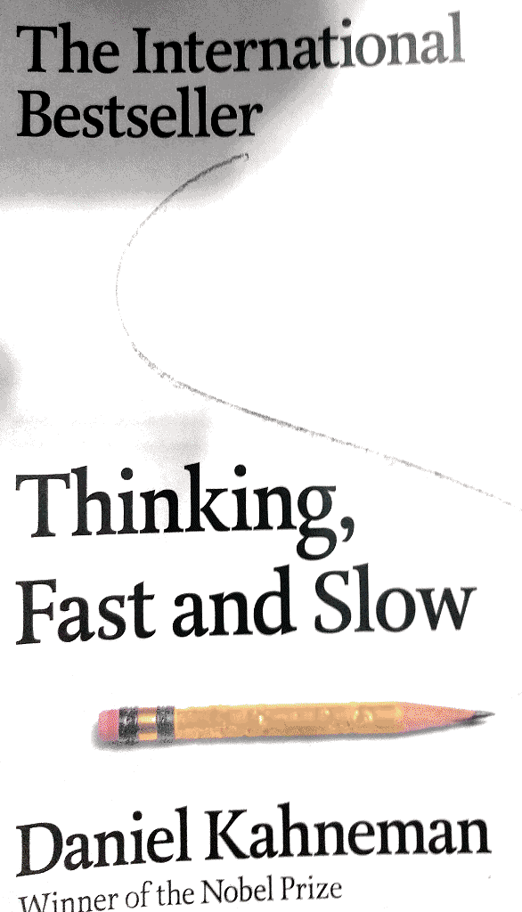
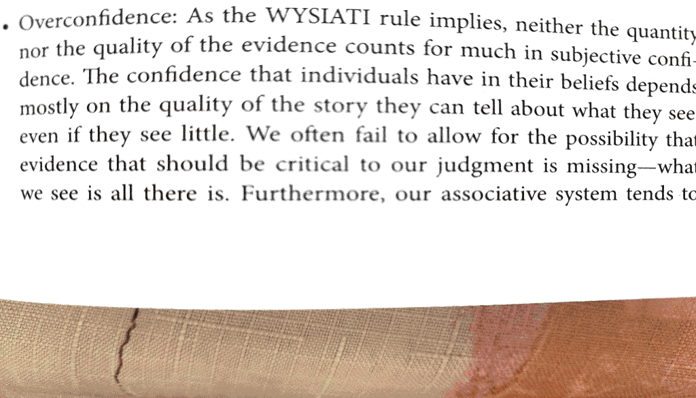
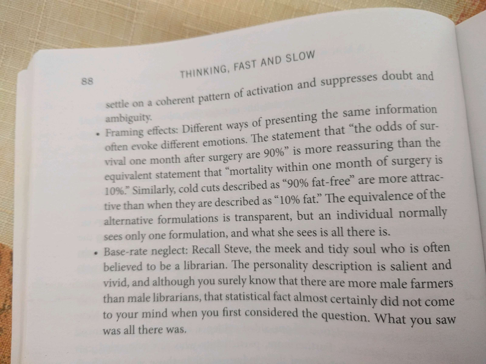
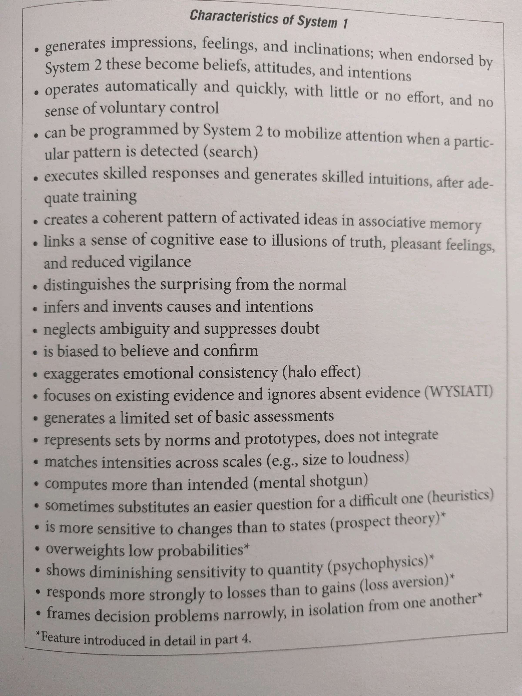

# Thinking, fast and slow

Two systems

    Abstract fictions, do not relate to some specific parts of the brain (at least no proof)

1. System 1 - operates automatically and quickly, with little or no effort and sense of control
2. System 2 - allocates attention to the effortful mental activities

Gorilla study

    Illustrates 2 important facts about mind:

    - we can be blind to the obvious

    - we blind to our blindness

Fiction systems make it easier to describe and understand complex things - nice thought, i should use it.

Cognitive illusions

    Impossible to detect, the best we can do is to recognize similar situations and involve System 2. Tedious to do it all the time though. And energy consuming.

Attention and effort 

    We cover long distances by taking time and conduct our lives by the law of less effort.

Lazy controller

    “Flow” - effortless concentration (no deliberate control). 

    Wish I could find such activity for me. That is gonna be better procrastination time.

    Self control and cognitive effort are forms of mental work (you much easily yield to temptation while busy with some demanding task). So self control function of system 2 is weakened by mental task. Same effect has alcohol or sleepless nights (without mental work). All variants of effort - cognitive, emotional, physical - share the same pool of energy.

   Ego depletion - phenomenon showing that an effort of will or self control is tiering. And it affects your next activities.

Keith Stanovich "Rationality and reflective mind".

- intelligence doesn't make immune to biases

- rationality controls this. Lazy thinking is a failure of rationality.

Associative machine

  Association of ideas. David Hume - 3 principles of association: resemblance, contiguity in time and place, causality. Associations are wired in a network, so one idea will cause lots of others, though not all will register in mind.

  Priming effect - ideas about actions affect actions ("Florida effect" - showed that thoughts associated with old people, would make young people walk slower). So smiling makes you feel amused because of association network. If you primed to find smth, you'll probably find only that (e.g. flaws)

   Cognitive ease.

 Multiple computations going in the brain all the time driven by system 1, which decides if extra effort from system 2 is required for any of them. This is measured by "cognitive ease and strain". Cognitive ease (no s2) - good mood, trust to intuitions. Cognitive strain (s2 involved) - less comfortable, invest more effort and control, less intuition.

   Illusions of remembering

Based on illusion of familiarity. If something unknown is primed in your mind, you have an illusion that you know what it is. But don't know the source, so be aware of such knowledge, it could easily be misleading. 

   Illusion of truth

Predictable illusions inevitably occur if judgement is based on cognitive ease. Repetition is a way to make people believe in false judgement, because familiarity is hard to distinguish from truth.

  Mere exposure effect - “familiarity breeds liking”. Even if something is unknown, but familiar, happens regularly - it causes positive impression (turkish words in newspapers experiment). 

 If you are in good mood - your S2 is probably weaker than usual.

Repetition is needed for new experience to become normal.

    Danny Kaye (comedian) - “her favorite position is behind herself, and her favorite sport is jumping to conclusions"

     Halo effect - a tendency to like everything about a person, even things you don’t know (if you like politician, you will like his voice also)

    WYSIATI - what you see is all there is. S1 is keen to make a decision (cognitive ease) based on only the information present (which is always not complete)

Basic assessment - we can judge about people just by one glance, or can see that lines have the same length (S1).

Mental shotgun - an intention to answer one question evokes another question etc. - we compete much more than needed.

     **Answering easier question**

Target question is assessment you intend to produce. The heuristic question is the simpler question that you answer instead. The process is called substitution. **S1 does it all the time**. To avoid using S2.

The dominance of conclusions over facts (most pronounced when emotions are involved) - affect heuristic.

   

The law of small numbers.

Large samples are more precise than small. Small samples yield extreme results more often than large.

Anchors

Anchoring effect occurs when people consider a particular value for unknown quantity before estimating that quantity.

Anchoring as adjustment. 

System 1 starts estimation at the anchor, then System 2 adjusts it, but stops prematurely, if has not enough data (have Gandhi lived more then 144 years?). So the final estimate is between anchor and true value.

Anchoring as priming effect.

S1 understands sentences by trying to make them true. So produces further thoughts, based on that. 

S2 operates with anchored data provided by S1, has no knowledge and control over it. So, try to set any anchors aside (do not take any number into account).

Availability heuristics - judging frequency by the ease with which instances come to mind. Availability bias - in joint projects everyone feels that he did more than fair share, because what is done easily comes to mind; recently cited in news information is more likely to affect your behavior - e.g. plane crashes.

Affect heuristics - instance of substitution, in which the answer to easy question (what do I feel about it?) serves as an answer to harder question (what do I think about it?).

Availability cascade - self sustaining chain of events, leading from small to big affects (mass media blow the small problem out).

Base rates (statistics) should dominate representativeness (Tom W example).

Worthless information should not be treated differently from a complete lack of information, but WYSIATY makes it difficult to apply this principle. 

Conjunction fallacy - committed when people judge of 2 events (bank teller and feminist) to be more probable then one (bank teller). Which is absurd from statistics. So, adding details to scenarios makes them more persuasive, but less likely to be true.

---

Question "how many" makes u think of items but "what percentage" does not. So harder to answer.
