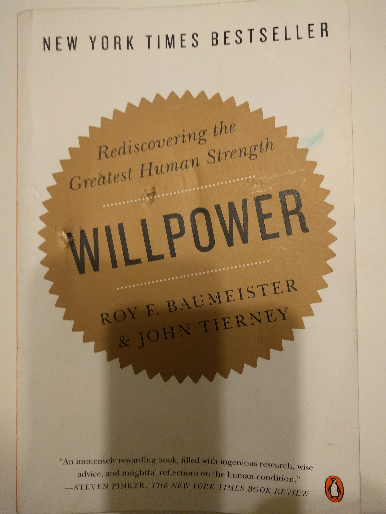

# Willpower

    Introduction

    - According to research, there are 2 qualities which predict positive outcomes in life - intelligence and self-control.
    - Many of personal problems - a failure of self-control.
    - History of willpower:
        - Middle ages - no need for W.
        - Victorian era - introduced term will as opposite to moral decay.
        - Nazis - triumph of will
        - Post WW2 - positive thinking, decline of will
        - Will does not exist - raise of self-esteem preachers
        - Nowadays - comeback of will
1. Is W. more than a metaphor?
    - “Ego depletion”: the effort of will leaves you with less energy (and W.) for next activities.
    - Stress does not cause emotions, but it depletes W., so it is harder to control some emotions.
    - You have one reservoir of self-control for all activities!
    - Uses of W.:
        - control of thoughts
        - control of emotions
        - impulse control (temptations)
        - performance control (focusing, persevering)
    - Focus on one project at a time, you don’t have enough W. in your reservoir to chase several.
2. Where does the power in W. come from?
    - The effort of W. requires glucose in your blood. Then you need to refill.
    - Ego depletion does not stop your brain from working, but shifts activities from one part of the brain to the other. So some things feel more intensely. You may use it as a sign of depletion, so need some food to restore glucose.
    - When depleted, body may crave sweets as the fastest  source of glucose, but other food works just fine (albeit slower). Glucose spike caused by sweets causes glucose crash again, which leaves you even more depleted. So, use sweets only in extreme cases, like running a marathon.
    - Eat good breakfast
    - When you eat, go for a slow burn- low glycemic index (nuts, veggies, fish, meat..)
    - When you are tired - sleep
    - If you are sick - save glucose for immune system
3. A brief history of To-Do list
    - First step in self-control - set clear goals
    - The problem now - too many goals
    - Another problem - conflicting goals, which come with consequences like:
        - you worry a lot
        - you get less done
        - health suffers, physically and mentally
    - So, clean your goals, avoid conflicting goals, prioritize, throw away unimportant
    - Having long-term goals is important, but divide them to short-term plans
    - Zeigarnik effect: Uncompleted tasks and goals tend to pop in mind all the time. Once task is completed - it stops. BUT, making a plans have the same effect - written down task stops appearing in your mind (GTD)!
    - Start with a clear desk, all previously planned things finished (or rescheduled)
4. Decision fatigue
    - Decision making depletes W., a lot. It works two ways: once you are depleted, you are not able to make decisions. Try to recognize such situations and postpone till W. is recharged.
    - Not able to make decisions - means you will most probably stick to safe default.
    - People have hard time giving up options - so try to avoid too many of them.
    - Closing a door on an option is experienced as a loss, even if option makes no good - human psychology. So do it when ego is not depleted.
    - Nature - sight of attractive woman makes men spend cash more easily 😃
5. The Quantified Self
    - Self-awareness involves comparing yourself to standards
    - Self-awareness helps self-regulation
    - Supervision (or even mirror) makes you more self-aware -> more self-control
    - People care more about what others know of them rather than what they know about themselves -> Public information has more impact.
    - If you want contentment - think of what you have achieved
    - If you want motivation - think of what yet to be done
6. Can W. be strengthened?
    - You can’t control your emotions. Emotional control involves tricks like changing your view of the problem or distracting yourself -> practicing emotional control will not strengthen your W.
    - Using different hand for routine tasks - seems to improve W. (short-term performance control)
    - You can strengthen your W. a lot for a limited period, if you are highly motivated. Especially if it goes public. But such kind of W. is finite too.
    - Biggest self-control challenge - to maintain routines for years, not for days.
7. Outsmarting yourself in the heart of darkness.
    - W. is a greatest human strength, but the best strategy is not to rely on it, but save for emergencies.
    - Lesson from Morton Stanley: start with pre-commitments, go public with them if necessary, and turn them eventually into habits. Habits do not require effort of W.!!
    - Again, self-control is necessary to establish good habits and break bad ones. But once it is a habit - it is a controllable behavior without the effort of W. So, use W. to produce habits, and you’ll achieve more in the long run.
    - Stanley: self-control is not selfish, it enables you to get along with others. (Sinek)
    - Narrow, concrete, here-and-now focus works against self-control, while a broad, long-term and abstract focus supports it.
8. Higher power (religion).
    - Religion promotes good values, by linking them to God’s will.
    - R. reduces inner conflicts among different goals and values.
    - R. affects 2 central mechanisms for self-control: building W. and self-monitoring.
    - Hyperbolic discounting: we can ignore temptation when it is not immediately available, but we lose perspective once it is right in front of us.
    - For building W. set your bright lines cleanly (e.g. "no sugar in my house", "stop drinking beer at all", but not “reduce the beer consumption per week” - doesn’t work.)
    - For building W. - get rid of temptations (e.g. clean your fridge from cheese, sugars and all the crap, you can allow some in the restaurant only)
9. Raising strong children: self-esteem vs. self-control.
    - The theory of self-esteem  was a well-intentioned attempt to use psychology for public good, promising at first, filed on practice.
    - Forget about self-esteem, work on self-control!!
    - Punishment: three basic facets - severity, speed and consistency. All require a vast amount of W. from parents!
    - Goals and rewards for kids (and grownups) should be set in advance, be consistent here too.
10. Dieting
    - Dieter’s catch-22. You need W. to keep on diet, you need more glucose to feed your W.
    - Use postponed pleasure ploy. Tell yourself you will eat some sweet later, meanwhile something else. It is much easier to say Later then Never.
    - Diet should not be a W. exercise, you should be able to keep it for months.
    - Preparation plans also work: "if they serve free flow, I will eat only veggies and meat”, “if drinks are free, I will have only 2”…
    - Sometimes you need glucose to refuel W., it is inevitable.

Conclusion: the future of W. - more gain, less strain.

- People with good self-control use it not to rescue in emergencies, but to develop effective habits!

    Know your limits:

- You supply of W. is limited, and you use the same resource for so many things. Just be aware of that when you need to make a decision. It might worth to postpone it.
- After making tough decision, W. is depleted for sure, so do not involve self-control in further actions. Thats why it is wiser to delay some things till the morning, when W. is replenished again.
- If you struggle with temptation and then give up - you used your W. anyway! So be quick to decide. Preparation plan works here, if you want to avoid temptation. If you give up - do it at the first thought and stick to your decision with no doubts.

    Watch for symptoms:

- When you are depleted frustration will bother you more than usual.
- Beware of making binding decisions when your energy is down, because you’ll favor options with short-term gains and delayed costs. Try to compensate by assigning extra weight to long-term consequences. Anyway, you capacity for fairness and balanced judgement will suffer. You’ll be more inclined to stick with status quo and less inclined to compromise, particularly if the trade-off includes mental work.
- Get some healthy food, wait half an hour, then the decision won’t seem so overwhelming.

Pick your battles.

- You can’t predict stresses, but you can use calm moments to prepare for the battle.
- Set aside several days to reflect on your goals and check achievements.
- Aiming for huge and big transformations will backfire if they seem impossible.
- Use effective planning to budget your willpower. Prepare for challenges ahead (like taxes, etc.)
- Budget your time for activities that require W. (e.g. “ I will spend 2h today for cleaning my apartment”, and leave it at whatever you managed to do today.)

Make a to-do list (or at least a to-don’t list).

- Once you have a specific plan, your unconscious is mollified. You should have at least the next step planned (GTD).

Beware  the planning fallacy.

- Base your predictions based on past experience where possible (including other people’s experience).
- Don’t go on working on the next goal when the previous is not done.

Don’t forget the basics:

- Better do some things in the morning, when W. is stronger.

Positive Procrastination.

- Procrastinators typically avoid one task by doing something else, not nothing at all.
- The Nothing Alternative - marvelous tool against procrastination of any kind: you do either this one task, or nothing at all. You must devote first X minutes of your day to some really important task without interruptions (email, calls, whatsoever)

Keep track.

- Monitoring is crucial for any kind of plan.
- Going public makes you more motivated.
- Quantified self.

Reward often.

- Reward yourself for achieving goals. Plan rewards in advance.
